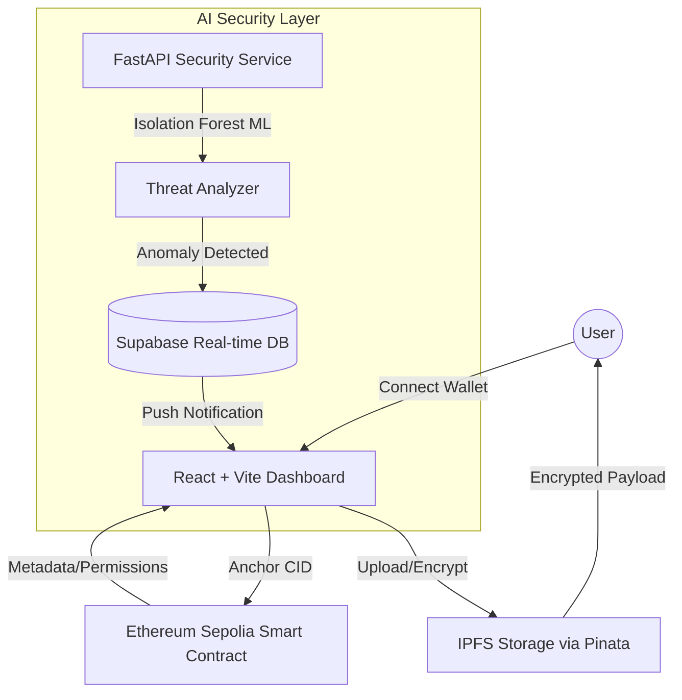
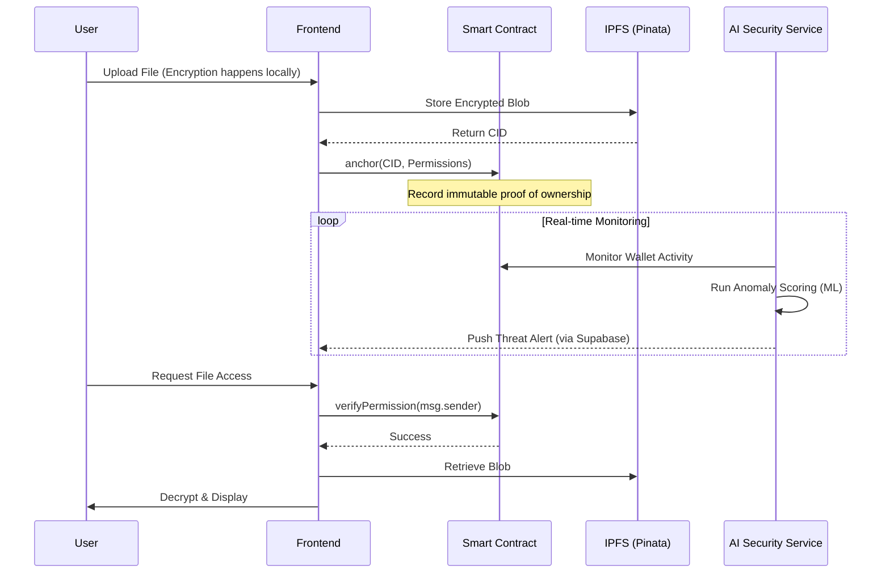

# 🛡️ DataFort AI: Secure Web3 Drive with AI Threat Monitoring
### Developed by Team Viterbee

[](https://react.dev/)
[](https://fastapi.tiangolo.com/)
[](https://soliditylang.org/)
[](https://supabase.com/)
[](https://ipfs.tech/)

**DataFort AI** is a next-generation decentralized storage platform that harmonizes the immutability of Blockchain with the proactive intelligence of AI. It provides a secure, permissioned environment for sensitive data sharing while maintaining a real-time "Security Operations Center" (SOC) to detect and mitigate anomalous wallet activities.

---

## 🏗️ System Architecture

DataFort AI utilizes a multi-layered architecture to ensure data integrity, privacy, and real-time responsiveness.



---

## 🔄 Core Workflow

The lifecycle of a file in DataFort AI is protected by dual verification: On-chain permissions and AI-driven behavior monitoring.



---

## ✨ Key Features

- **Decentralized Integrity**: Files are stored on IPFS and anchored to the Ethereum Sepolia testnet, ensuring no single point of failure.
- **AI Threat Monitoring**: A custom-built ML pipeline uses **Isolation Forest** algorithms to detect unusual wallet interactions and brute-force attempts.
- **SOC Dashboard**: A professional-grade monitoring interface with real-time risk charts, event sequence tracking, and instant alerts.
- **Smart Access Control**: Granular `allow` and `disallow` logic handled natively by Solidity smart contracts.
- **Zero-Knowledge Privacy**: Data is encrypted before leaving the client's browser, ensuring that even node providers cannot view raw contents.

---

## 💻 Technical Stack

| Layer | Technology | Purpose |
| :--- | :--- | :--- |
| **Frontend** | React, Tailwind CSS, Framer Motion | Premium Responsive UI & UX |
| **Web3** | Ethers.js, Web3Modal, WalletConnect | Wallet orchestration & Chain interaction |
| **Backend** | FastAPI, Python | AI Security Service & API Gateway |
| **Machine Learning** | Scikit-learn (Isolation Forest) | Anomaly detection & behavior scoring |
| **Blockchain** | Solidity, Hardhat | On-chain metadata and permissions |
| **Real-time** | Supabase | Live threat telemetry and alerts |
| **Storage** | IPFS (Pinata) | Scalable decentralized file storage |

---

## ⚙️ Quick Start

### 1. Requirements
- Node.js v16+
- Python 3.9+
- MetaMask Extension
- Supabase Project & URL

### 2. Frontend Setup
```bash
cd client
npm install
npm run dev
```
*Variables: Update `client/src/utils/constants.js` with your Deployed Contract Address.*

### 3. Backend (AI Service) Setup
```bash
cd backend
python -m venv .venv
source .venv/bin/activate  # Or .venv\Scripts\activate on Windows
pip install -r requirements.txt
uvicorn app:app --reload
```

### 4. Smart Contract
```bash
cd smart_contract
npm install
npx hardhat run scripts/deploy.js --network sepolia
```

---

## 🛡️ Security
DataFort AI is designed for maximum transparency and security. Threat alerts are delivered via a custom-implemented **Notification Bell** system that tracks event sequences to provide clear attack vectors to the end-user.

---

## 🤝 Team Viterbee
Built with passion for the future of secure, intelligent Web3 storage.
